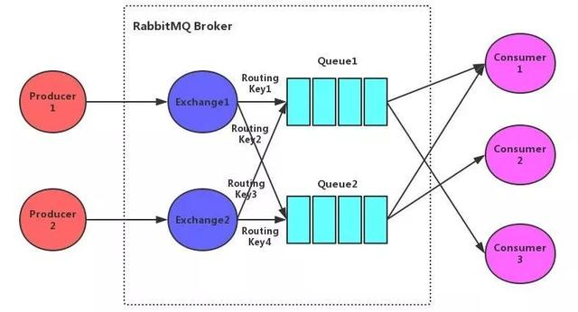
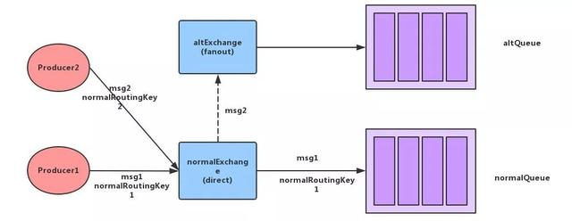
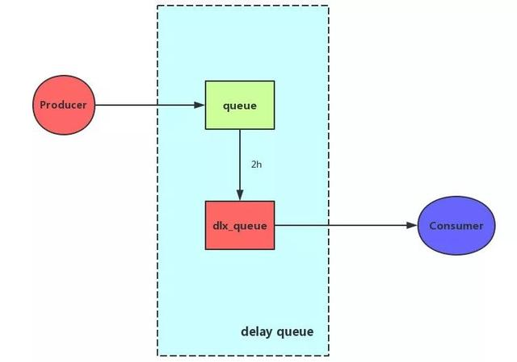
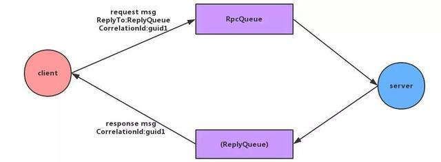

# RabbitMQ文档

### 一、生产者、消费者

#### 1.RabbitMQ流程



- 生产者
   - 生产者连接到RabbitMQ Broker，建立一个连接(Connection)开启一个信道(Channel)
   - 生产者声明一个交换器，并设置相关属性，比如交换器类型、是否持久化等
   - 生产者声明一个队列井设置相关属性，比如是否排他、是否持久化、是否自动删除等
   - 生产者通过路由键将交换器和队列绑定起来
   - 生产者发送消息至RabbitMQ Broker，其中包含路由键、交换器等信息
   - 相应的交换器根据接收到的路由键查找相匹配的队列
   - 如果找到，则将从生产者发送过来的消息存入相应的队列中
   - 如果没有找到，则根据生产者配置的属性选择丢弃还是回退给生产者
   - 关闭信道
   - 关闭连接
- 消费者：
   - 消费者连接到RabbitMQ Broker ，建立一个连接(Connection)，开启一个信道(Channel)
   - 消费者向RabbitMQ Broker请求消费相应队列中的消息，可能会设置相应的回调函数
   - 等待RabbitMQ Broker回应并投递相应队列中的消息，消费者接收消息
   - 消费者确认(ack) 接收到的消息
   - RabbitMQ从队列中删除相应己经被确认的消息
   - 关闭信道
   - 关闭连接
   
### 二、交换器
 
#### 2.1.四种交换器
 - fanout：扇形交换器
 - direct：direct交换器
 - topic：主题交换器
 - header：header交换器
 
#### 2.2.交换器说明
- fanout：扇形交换器它会把发送到该交换器的消息路由到所有与该交换器绑定的队列中。如果使用扇形交换器，则不会匹配路由Key。
- direct：direct交换器，会把消息路由到RoutingKey与BindingKey完全匹配的队列中。
- topic：完全匹配BindingKey和RoutingKey的direct交换器有些时候并不能满足实际业务的需求。
topic类型的交换器在匹配规则上进行了扩展，它与direct类型的交换器相似，也是将消息路由到BindingKey和RoutingKey相匹配的队列中，但这里的匹配规则有些不同，它约定:
   - RoutingKey为一个点号"."分隔的字符串(被点号"."分隔开的每一段独立的字符串称为一个单词)，如"hs.rabbitmq.client"，"com.rabbit.client"等。
   - BindingKey和RoutingKey一样也是点号"."分隔的字符串；
   - BindingKey中可以存在两种特殊字符串"*"和"#"，用于做模糊匹配，其中"*"用于匹配一个单词，"#"用于匹配多规格单词(可以是零个)。
- header：headers类型的交换器不依赖于路由键的匹配规则来路由消息，而是根据发送的消息内容中的headers属性进行匹配。
在绑定队列和交换器时制定一组键值对，当发送消息到交换器时，RabbitMQ会获取到该消息的headers (也是一个键值对的形式) ，
对比其中的键值对是否完全匹配队列和交换器绑定时指定的键值对，如果完全匹配则消息会路由到该队列，否则不会路由到该队列。

### 三、mandatory和备份交换器

生产者将消息发送到RabbitMQ的交换器中通过RoutingKey与BindingKey的匹配将之路由到具体的队列中，以供消费者消费。
那么当我们通过匹配规则找不到队列的时候，消息将何去何从呢？
Rabbit给我们提供了两种方式：mandatory与备份交换器。

#### 3.1mandatory参数

mandatory参数是channel.BasicPublish方法中的参数。其主要功能是消息传递过程中不可达目的地时将消息返回给生产者。
当mandatory参数设为true 时，如果交换器无法根据自身的类型和路由键找到一个符合条件的队列，那么RabbitMQ会调用BasicReturn命令将消息返回给生产者；当mandatory 参数设置为false 时，则消息直接被丢弃。
其运转流程与实现代码如下：

```
// 声明交换器
String exchangeName = "direct.exchange.test.mandatory";
AMQP.Exchange.DeclareOk declareOk = channel.exchangeDeclare(exchangeName, "direct", true);
// 声明队列
String queueName = "direct.queue.test.mandatory";
Map<String, Object> arguments = new HashMap<>();
String queue = channel.queueDeclare(queueName, true, false, false, null).getQueue();
// 绑定交换器和队列
String routingKey = "direct.routing-key.test.mandatory";
channel.queueBind(queue, exchangeName, routingKey);

/*
// 正常路由的消息
byte[] content = ("Test Msg " + System.currentTimeMillis()).getBytes("UTF-8");
channel.basicPublish(exchangeName, routingKey, true, null, content);

// 不可路由的消息
byte[] content2 = ("Test Msg2 " + System.currentTimeMillis()).getBytes("UTF-8");
channel.basicPublish(exchangeName, routingKey + "2", true, null, content2);
*/

// 正常路由的消息
channel.basicPublish(exchangeName, routingKey, true, MessageProperties.TEXT_PLAIN, "Test Msg".getBytes("UTF-8"));

// 正常路由的消息
channel.basicPublish(exchangeName, routingKey + "2", true, MessageProperties.TEXT_PLAIN, "Test Msg2".getBytes("UTF-8"));

channel.addReturnListener(new ReturnListener() {
    @Override
    public void handleReturn(int replyCode, String replyText, String exchange, String routingKey, AMQP.BasicProperties properties, byte[] body) throws IOException {
        String message = new String(body, "UTF-8");
        System.out.println(message);
    }
});
```

#### 3.2备份交换器 

当消息不能路由到队列时，通过mandatory设置参数，我们可以将消息返回给生产者处理。但这样会有一个问题，就是生产者需要开一个回调的函数来处理不能路由到的消息，这无疑会增加生产者的处理逻辑。
备份交换器(Alternate Exchange)则提供了另一种方式来处理不能路由的消息。

备份交换器可以将未被路由的消息存储在RabbitMQ中，在需要的时候去处理这些消息。其主要实现代码如下：

```
// 声明交换器
String altExchangeName = "direct.exchange.test.alt";
String exchangeName = "direct.exchange.test.alt-normal";

String altQueueName = "direct.queue.test.alt";
String queueName = "direct.queue.test.alt-normal";

String altRoutingKey = "direct.routing-key.test.alt";
String routingKey = "direct.routing-key.test.alt-normal";

Map<String, Object> args = new HashMap<>();
args.put("alternate-exchange", altExchangeName);
AMQP.Exchange.DeclareOk declareOk = channel.exchangeDeclare(exchangeName, "direct", true, false, args);
AMQP.Exchange.DeclareOk fanoutDeclareOK = channel.exchangeDeclare(altExchangeName, "fanout", true, false, null);

// 声明队列
String queue = channel.queueDeclare(queueName, true, false, false, null).getQueue();
String altQueue = channel.queueDeclare(altQueueName, true, false, false, null).getQueue();

// 绑定交换器和队列
channel.queueBind(queue, exchangeName, routingKey);
channel.queueBind(altQueue, altExchangeName, altRoutingKey);

// 正常路由，进入队列
byte[] content = ("Test Msg " + System.currentTimeMillis()).getBytes("UTF-8");
channel.basicPublish(exchangeName, routingKey, false, null, content);

// 不可路由，进入备份交换器
byte[] content2 = ("Test Msg2 " + System.currentTimeMillis()).getBytes("UTF-8");
channel.basicPublish(exchangeName, routingKey + "2", false, null, content2);
```



备份交换器其实和普通的交换器没有太大的区别，为了方便使用，建议设置为**fanout**类型。

需要注意的是，消息被重新发送到备份交换器时的路由键和从生产者发出的路由键是一样的。

考虑这样一种情况，如果备份交换器的类型是direct，并且有一个与其绑定的队列，假设绑定的路由键是key1，当某条携带路由键为key2的消息被转发到这个备份交换器的时候，备份交换器没有匹配到合适的队列，则消息丢失；如果消息携带的路由键为key1，则可以存储到队列中。

对于备份交换器，有以下几种特殊情况：
- 如果设置的备份交换器不存在，客户端和RabbitMQ服务端都不会有异常出现，此时消息会丢失；
- 如果备份交换器没有绑定任何队列，客户端和RabbitMQ服务端都不会有异常出现，此时消息会丢失；
- 如果备份交换器没有任何匹配的队列，客户端和RabbitMQ服务端都不会有异常出现，此时消息会丢失；
- 如果备份交换器和mandatory参数一起使用，那么mandatory参数无效。

### 四、过期时间(TTL)

RabbitMQ支持设置消息和队列的过期时间。一个是过期后删除消息，一个是过期后删除队列。

#### 4.1.设置消息的TTL

##### 4.1.1设置消息TTL的两种方式：
- 通过队列属性设置，队列中所有消息都有相同的过期时间；
- 对消息本身进行单独设置，每条消息的TTL可以不同。

备注：
如果两种方法一起使用，则消息的TTL以两者之间较小的那个数值为准。
消息在队列中的生存时间一旦超过设置的TTL值时，就会变成“死信” (Dead Message) ，消费者将无法再收到该消息。

##### 4.1.2设置队列所有消息的TTL

通过队列属性设置消息TTL的方法是在channel.QueueDeclare方法中加入 **x-message-ttl** 参数实现的，这个参数的单位是毫秒。示例代码下：

```
Map<String, Object> arguments = new HashMap<>();
arguments.put("x-message-ttl", 5000);
String ttlQueue = channel.queueDeclare(queueName, true, false, false, arguments).getQueue();
```

注：如果不设置TTL，则表示此消息不会过期；如果将TTL设置为0 ，则表示除非此时可以直接将消息投递到消费者，否则该消息会被立即丢弃(或由死信队列来处理)。

##### 4.1.3设置每条消息的TTL

每条消息设置TTL的方法是在channel.BasicPublish方法中加入**Expiration的属性参数**，单位为毫秒。示例代码如下：

```
AMQP.BasicProperties.Builder builder = new AMQP.BasicProperties.Builder();
builder.deliveryMode(2);
builder.expiration("5000");// 单位ms
channel.basicPublish(exchangeName, routingKey, false, null, content);
```

注：
> - 对于第一种设置队列TTL属性的方法，一旦消息过期，就会从队列中抹去；
> - 在第二种方法中，即使消息过期，也不会马上从队列中抹去，因为每条消息是否过期是在即将投递到消费者之前判定的。

Why？

> - 在第一种方法里，队列中己过期的消息肯定在队列头部，RabbitMQ只要定期从队头开始扫描是否有过期的消息即可；
> - 第二种方法里，每条消息的过期时间不同，如果要删除所有过期消息势必要扫描整个队列，所以不如等到此消息即将被消费时再判定是否过期，如果过期再进行删除即可。

#### 4.2.设置队列的TTL

这里和上面通过队列设置消息的TTL不同。上面删除的是消息，而这里删除的是队列。

通过channel.QueueDeclare方法中的 **x-expires** 参数可以控制队列被自动删除前处于未使用状态的时间。这个未使用的意思是队列上没有任何的消费者，队列也没有被重新声明，并且在过期时间段内也未调用过channel.BasicGet命令。

设置队列里的TTL可以应用于类似RPC方式的回复队列，在RPC中，许多队列会被创建出来，但是却是未被使用的。RabbitMQ会确保在过期时间到达后将队列删除，但是不保障删除的动作有多及时。

在RabbitMQ重启后，持久化的队列的过期时间会被重新计算。用于表示过期时间的 **x-expires** 参数以毫秒为单位，井且服从和 **x-message-ttl** 一样的约束条件，只不过不同的是它不能设置为0(会报错)。

```
Map<String, Object> arguments = new HashMap<>();
arguments.put("x-expires", 1800000);
String ttlQueue = channel.queueDeclare(queueName, true, false, false, arguments).getQueue();

```

### 五、死信队列

DLX(Dead-Letter-Exchange)是指死信交换器。
当消息在一个队列中变成死信之后，它能重新被发送到另一个交换器中，这个交换器就是DLX ，绑定DLX的队列就被称为死信队列。

消息变成死信主要有以下几种情况：
- 消息被拒绝(BasicReject/BasicNack) ，井且设置requeue参数为false；(消费者确认机制我们将会在下一篇文章中涉及)
- 消息过期；
-  队列达到最大长度。

DLX也是一个正常的交换器，和一般的交换器没有区别，它能在任何队列上被指定，实际上就是设置某个队列的属性。

当这个队列中存在死信时，RabbitMQ就会自动地将这个消息重新发布到设置的DLX上去，进而被路由到另一个队列，即死信队列。可以监听这个队列中的消息、以进行相应的处理。

通过在channel.QueueDeclare方法中设置x-dead-letter-exchange参数来为这个队列添加DLX。其示例代码如下：

```
String exchangeName = "direct.exchange.test.dlx.normal";
String dlxExchangeName = "direct.exchange.test.dlx";

String queueName = "direct.queue.test.dlx.normal";
String dlxQueueName = "direct.queue.test.dlx";

String routingKey = "direct.routing-key.test.dlx.normal";
String dlxRoutingKey = "direct.routing-key.test.dlx";

// 普通交换器、队列
AMQP.Exchange.DeclareOk declareOk = channel.exchangeDeclare(exchangeName, "direct", true);
// 声明队列，设置普通队列过期时间，死信队列交换器、路由key
Map<String, Object> arguments = new HashMap<>();
arguments.put("x-message-ttl", 5000);
arguments.put("x-dead-letter-exchange", dlxExchangeName);
arguments.put("x-dead-letter-routing-key", dlxRoutingKey);
String queue = channel.queueDeclare(queueName, true, false, false, arguments).getQueue();
// 绑定交换器和队列
channel.queueBind(queue, exchangeName, routingKey);

// 死信交换器、队列
AMQP.Exchange.DeclareOk dlxDeclareOk = channel.exchangeDeclare(dlxExchangeName, "direct", true);
// 声明队列
String dlxQueue = channel.queueDeclare(dlxQueueName, true, false, false, null).getQueue();
// 绑定交换器和队列
channel.queueBind(dlxQueue, dlxExchangeName, dlxRoutingKey);

byte[] content = "Test Msg".getBytes("UTF-8");
channel.basicPublish(exchangeName, routingKey, false, null, content);
```

### 六、延迟队列

RabbitMQ本身并未提供延迟队列的功能。
延迟队列是一个逻辑上的概念，可以通过过期时间+死信队列来模拟它的实现。延迟队列的逻辑架构大致如下：



生产者将消息发送到过期时间为n的队列中，这个队列并未有消费者来消费消息，当过期时间到达时，消息会通过死信交换器被转发到死信队列中。

而消费者从死信队列中消费消息。这个时候就达到了“生产者发布了消息，在过了n时间后消费者消费了消息”，起到了延迟消费的作用。

延迟队列在我们的项目中可以应用于很多场景，如：下单后两个消息取消订单，七天自动收货，七天自动好评，密码冻结后24小时解冻，以及在分布式系统中消息补偿机制(1s后补偿，10s后补偿，5m后补偿......)。

### 七、优先级队列

队列中的消息会有优先级，优先级高的消息具备优先被消费的特权。针对这些消息，我们只需做两件事：
- 将队列声明为优先级队列，即在创建队列的时候添加参数x-max-priority指定最大的优先级，值为0-255（整数）。
- 为优先级消息添加优先级。

其示例代码如下：

```
// 声明交换器
String exchangeName = "direct.exchange.test.priority";
AMQP.Exchange.DeclareOk declareOk = channel.exchangeDeclare(exchangeName, "direct", true);

// 声明队列
String queueName = "direct.queue.test.priority";
Map<String, Object> arguments = new HashMap<>();
// 定义队列优先的最大优先级最大为10
arguments.put("x-max-priority", 10);
String ttlQueue = channel.queueDeclare(queueName, true, false, false, arguments).getQueue();
// 绑定交换器和队列
String routingKey = "direct.routing-key.test.priority";
channel.queueBind(ttlQueue, exchangeName, routingKey);

byte[] content = ("Test Msg " + System.currentTimeMillis()).getBytes("UTF-8");
// 设置消息的优先级为8
AMQP.BasicProperties.Builder builder = new AMQP.BasicProperties.Builder();
builder.priority(8);
channel.basicPublish(exchangeName, routingKey, false, null, content);
```

如果在消费者的消费速度大于生产者的速度且Broker中没有消息堆积的情况下，对发送的消息设置优先级也就没有什么实际意义。
因为生产者刚发送完一条消息就被消费者消费了，那么就相当于Broker中至多只有一条消息，对于单条消息来说优先级是没有什么意义的。

### 八、RPC实现

RPC是Remote Procedure Call的简称，即远程过程调用。
它是一种通过网络从远程计算机上请求服务，不需要了解底层网络的技术。
RPC的主要功用是让构建分布式计算更容易，在提供强大的远程调用能力时不损失本地调用的语义简洁性。
有关RPC不多介绍，这里我们主要介绍RabbitMQ如何实现RPC。

RPC处理流程如下：



- 当客户端启动时，创建一个匿名的回调队列。
- 客户端为RPC请求设置2个属性：ReplyTo用来告知RPC服务端回复请求时的目的队列，即回调队列；CorrelationId用来标记一个请求。
- 请求被发送到RpcQueue队列中。
- RPC服务端监听RpcQueue队列中的请求，当请求到来时，服务端会处理并把带有结果的消息发送给客户端。接收的队列就是ReplyTo设定的回调队列。
- 客户端监听回调队列，当有消息时，检查CorrelationId属性，如果与请求匹配，那就是结果了。

### 8.1使用RabbitMQ封装好的RPC服务端和客户端

略

### 8.2使用自定义RPC服务端和客户端

